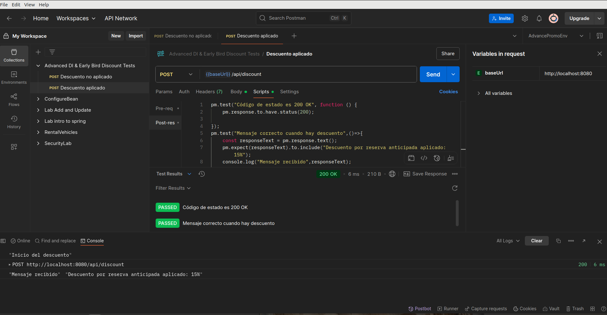
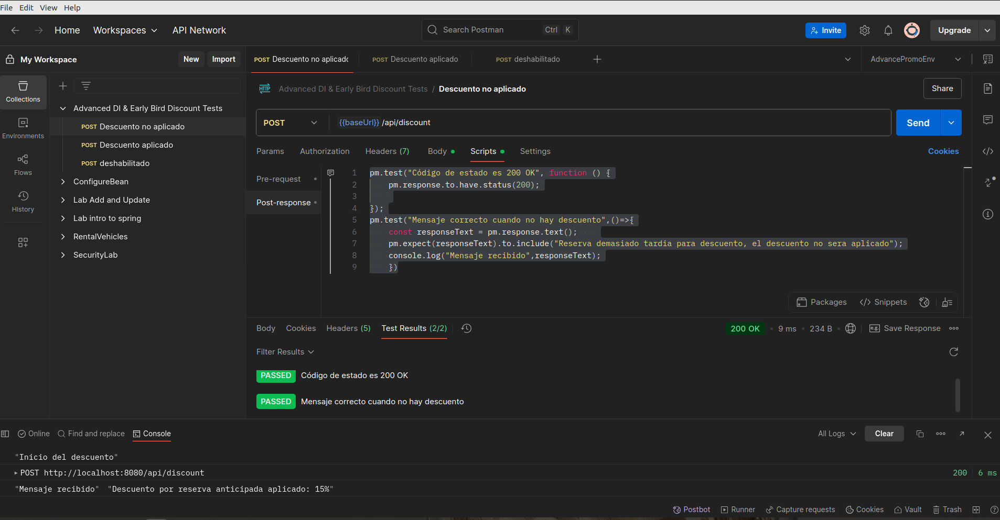
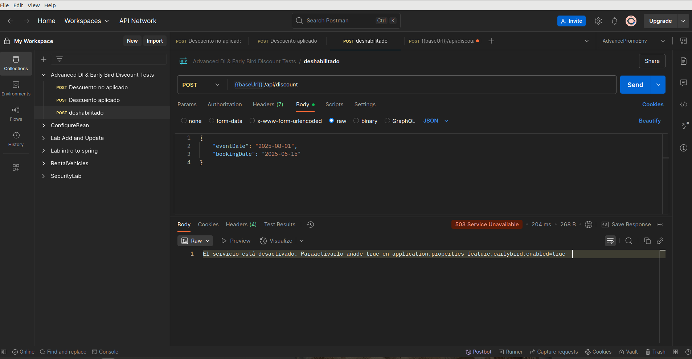
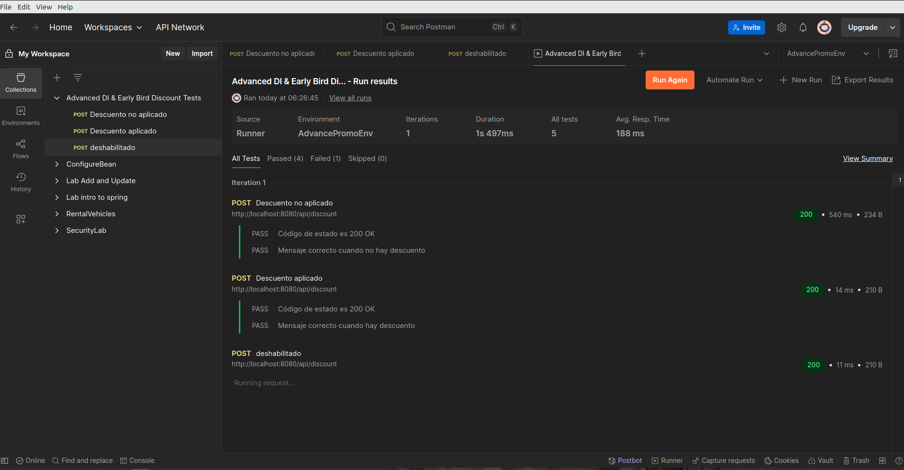

### 3. Documentation in README.md

Update your repository’s `README.md` to include:

- A brief explanation of your design choices for the **EarlyBirdDiscountService**.
  - Answers to:
    - Why did you choose constructor-based DI for this lab?  
  
        La inyección por constructor permite que las dependencias se asignen una única vez al crear el objeto
      
     - What advantages do Postman pre-request and post-response scripts offer for automated testing?  
        Los scripts de Postman permiten automatizar pruebas simulando condiciones dinámicas antes de enviar 
       (pre-request) y validando respuestas después (post-response)  
      - How does your application behave when the early bird feature is disabled?  
      la llamadas al endPoint responden con un mensaje 
      - What are some challenges you faced when integrating advanced DI with API testing?
        hacer los test en Postman, nunca los habia hecho
 

## Imagenes Postman

